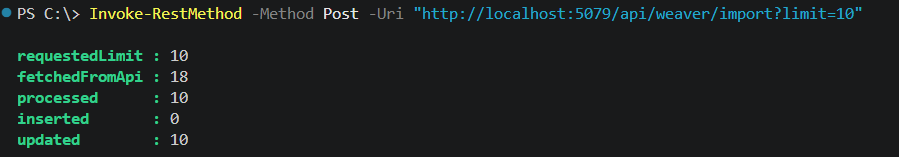
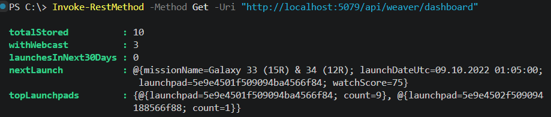
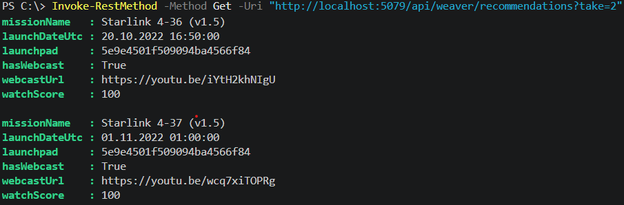

# PublicApiWeaver (.NET 10)

1. Pobiera dane o startach z publicznego API SpaceX.
2. Zapisuje je lokalnie w bazie SQLite.
3. Udostępnia dashboard i rekomendacje startów na podstawie Watch Score (0-100).

## Cel projektu
Celem projektu jest stworzenie prostego API, które integruje się z zewnętrrznym SpaceX API, przechowuje dane lokalnie i udostępnia je w formacie rekomendacji.

Rekomendacje są oparte na `WatchScore`, który jest obliczany na podstawie:

- Punkt bazowy: `50`
- Dostępność transmisji (`webcastUrl`): `+25`
- Termin startu względem `DateTimeOffset.UtcNow`:
  - `<= 7 dni`: `+25`
  - `<= 21 dni`: `+15`
  - `<= 60 dni`: `+5`
  - `> 60 dni`: `-10`
- Typ misji na podstawie `missionName` (case-insensitive):
  - zawiera `Crew`: `+15`
  - zawiera `Transporter`: `+10`
  - zawiera `Starlink`: `+8`
- Brak launchpada (`launchpad` jest `null`/pusty): `-5`
- Brak daty startu (`launchDateUtc == null`): `-15` od wyniku bazowego
- Wynik końcowy jest ograniczany do zakresu `0-100` (`Math.Clamp`)

## Stack

- .NET 10 (ASP.NET Core Minimal API)
- EF Core 10 + SQLite
- HttpClient do integracji z API SpaceX

## Jak uruchomić

1. Przejście do katalogu projektu:

```powershell
cd PublicApiWeaver
```

2. (Opcjonalnie, jeśli NuGet nie jest skonfigurowany) dodanie pakietów:

```powershell
dotnet nuget add source https://api.nuget.org/v3/index.json -n nuget.org
```

3. Uruchomienie aplikacji:

```powershell
dotnet run --urls http://localhost:5079
```

Po starcie aplikacja automatycznie utworzy plik bazy SQLite: launches.db.

## Endpointy

- POST /api/weaver/import?limit=20
  - Co robi: pobiera starty z API SpaceX, filtruje rekordy `upcoming`, sortuje po dacie i zapisuje je do SQLite.
  - Parametr: `limit` (opcjonalny, domyślnie 20, zakres 1-100).
  - Jak działa zapis: jeśli start o tym samym `ExternalId` już istnieje, rekord jest aktualizowany; w przeciwnym razie dodawany.
  - Przykładowa odpowiedź:



- GET /api/weaver/dashboard
  - Co robi: zwraca zagregowany widok danych zapisanych lokalnie.
  - Zwraca:
    - `totalStored`: liczba wszystkich rekordów w bazie,
    - `withWebcast`: ile startów ma link do transmisji,
    - `launchesInNext30Days`: ile startów przypada w najbliższych 30 dniach,
    - `nextLaunch`: najbliższy przyszły start (lub najwcześniejszy dostępny, jeśli brak przyszłych),
    - `topLaunchpads`: 3 najczęściej występujące launchpady.
  - Przykładowa odpowiedź:



- GET /api/weaver/recommendations?take=5
  - Co robi: zwraca listę rekomendowanych startów na podstawie `WatchScore` (0-100).
  - Parametr: `take` (opcjonalny, domyślnie 5, zakres 1-20).
  - Logika kolejności: preferowane są starty z datą, z priorytetem dla przyszłych, następnie malejąco po `WatchScore`.
  - Przykładowa odpowiedź:



## Przykładowe wywołania

```powershell
Invoke-RestMethod -Method Post -Uri "http://localhost:5079/api/weaver/import?limit=10"
Invoke-RestMethod -Method Get -Uri "http://localhost:5079/api/weaver/dashboard"
Invoke-RestMethod -Method Get -Uri "http://localhost:5079/api/weaver/recommendations?take=3"
```

## Kody odpowiedzi

- 200 OK
- 500 Internal Server Error

## Testy

Projekt zawiera testy oparte na xUnit:

- **9 testów jednostkowych** (`LaunchImportServiceTests`):

- **1 test end-to-end** (`ApiEndToEndTests`):
  - Pełny scenariusz: import -> dashboard -> recommendations
  - Uruchamia host aplikacji z testową bazą SQLite
  - Weryfikuje poprawność integracji endpointów

### Uruchomienie testów

```powershell
cd .\PublicApiWeaver.Tests\
dotnet test
```